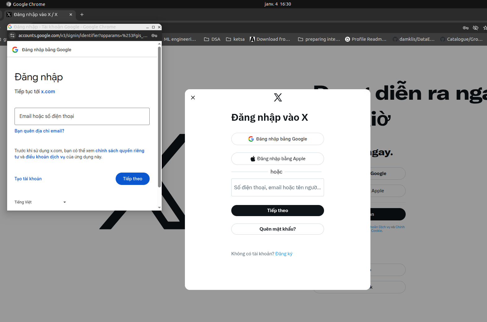
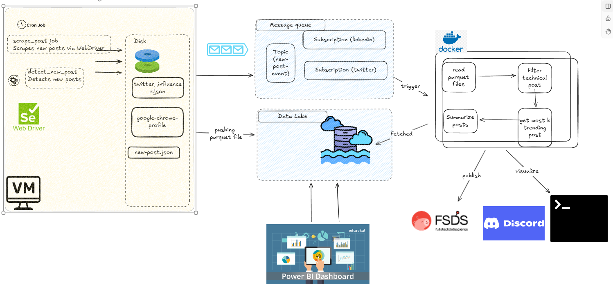
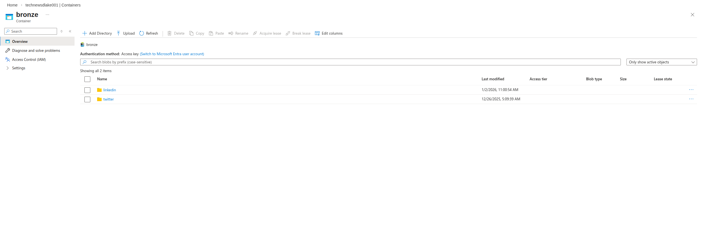
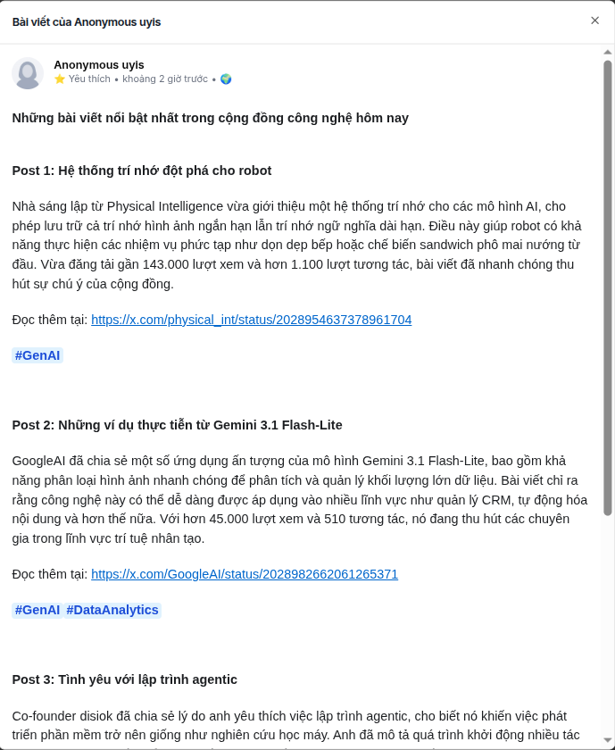
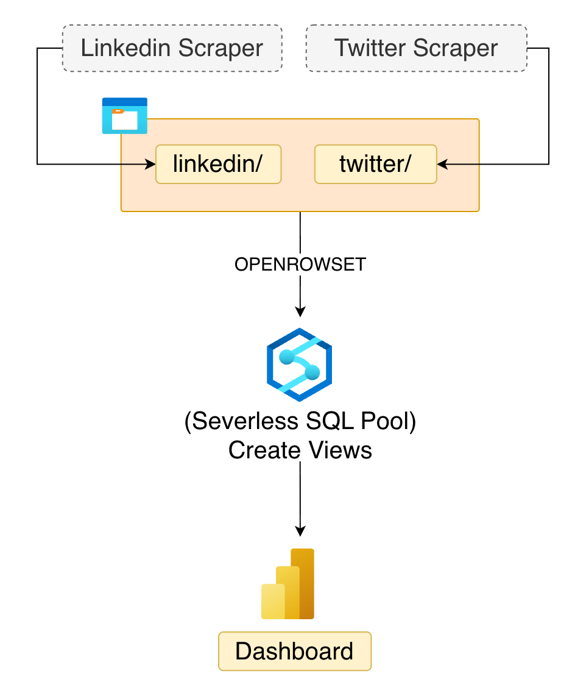
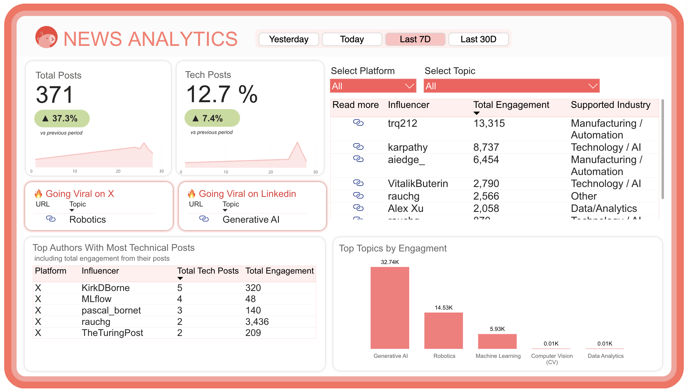

# Table of Contents

- [Getting Started](#getting-started)
  - [Prepare Environment](#prepare-enviroment)
    - [Create and Activate a Virtual Environment](#create-and-activate-a-virtual-environment)
    - [Configure PYTHONPATH](#configure-pythonpath)
    - [Install Project Dependencies](#install-project-dependencies)
  - [Install Google Chrome](#install-google-chrome)
  - [Create a Persistent Chrome User Profile](#create-a-persistent-chrome-user-profile)
    - [Create and Initialize the Profile](#create-and-initialize-the-profile)
    - [Manually Sign In (One-Time Only)](#manually-sign-in-one-time-only)
  - [Runing Auto Scraping in Local](#runing-auto-scraping-in-local)
    - [Network of Influencers](#network-of-influencers)
    - [Run the Scraper Locally](#run-the-scraper-locally)
    - [Run the New Post Detection Service](#run-the-new-post-detection-service)
- [Running Tests](#running-tests)
  - [Environment Setup](#environment-setup)
  - [Unit Tests](#unit-tests)
  - [Integration Tests](#integration-tests)
- [Project structure](#project-structure)
- [Architecture Diagram](#architecture-diagram)
  - [Scraping Service (Producer Layer)](#scraping-service-producer-layer)
    - [Why a Virtual Machine (VM) Should Be Used in this use case.](#why-a-virtual-machine-vm-should-be-used-in-this-use-case)
  - [Data Lake (Storage Layer)](#data-lake-storage-layer)
    - [Bronze Layer](#bronze-layer)
    - [Silver Layer](#silver-layer)
  - [Message Queue (Event / Trigger Layer)](#message-queue-event--trigger-layer)
  - [Filtering / Consumer Service](#filtering--consumer-service)
  - [Presentation](#presentation)
  - [Visualization](#visualization)

- [TODO](#todo)

# Getting started

This project automates a web scraping workflow using Selenium WebDriver. The system is designed to collect and process content from two primary sources:

- X (formerly Twitter).
- LinkedIn.

In addition to data collection, the project includes a summarization service that analyzes recently scraped posts to identify if the post is technical/non-technical and summarize hot or trending content from the past few days.

To get started, follow the steps below.

## Prepare enviroment 

### Create and activate a virtual environment
Install all dependencies dedicated to the project in local.

```bash
python3 -m venv .venv
source .venv/bin/activate
```

### Configure PYTHONPATH
Configure PYTHONPATH, ensure Python can correctly resolve local modules.
```bash
export PYTHONPATH="${PYTHONPATH}:./src"
```

### Install project dependencies
Install project dependencies.
```bash
pip install -r src/requirements.txt
```

## Install Google Chrome
This project requires Google Chrome (not Chromium) because:
- It supports Google Account sign-in fully
- Its profile structure is stable and compatible with Selenium
- It matches ChromeDriver behavior exactly

Ensure google-chrome is available:
```
google-chrome --version
```

## Create a Persistent Chrome User Profile

A Chrome user data directory is where Chrome persists all browser state, including login sessions (Google, X/Twitter), cookies and authentication tokens, local storage and IndexedDB, device trust signals and security fingerprints, as well as profile preferences and encryption keys.

Using a persistent profile allows us to log in manually only once, automatically reuse authenticated sessions across runs, avoid repeated username/password prompts. You need to create a user data dir, sign in manually to X using google account for persistent chrome user data directory 

Crucially, cookies do not need to be manually refreshed: when Chrome loads a trusted profile, it also restores encrypted refresh tokens, OAuth state, and site-specific session metadata stored in local storage and IndexedDB. As long as these underlying credentials remain valid, the browser transparently performs background re-authentication with the service, issuing new session cookies automatically during normal page loads. This renewal mechanism is handled entirely by the browser and the service itself, making persistent profiles far more stable and reliable than manual cookie injection, which lacks the context required for automatic session renewal.

### Create and initialize the profile
```bash
google-chrome --user-data-dir=./google-chrome --profile-directory=Profile_Twitter
```
This will:

- Create a new Chrome user data directory at `./google-chrome`.
- Initialize a profile named Profile_Twitter.

You can repeat this process with a different profile name to manage authentication for additional resources:
`--profile-directory=Profile_LinkedIn`

Using separate profiles allows you to maintain independent login sessions for different platforms (e.g., X, LinkedIn).

### Manually sign in (one-time only)

When Chrome opens with the new profile:
- Sign in to your Google account.
- Navigate to https://x.com.
- Complete the X authentication flow: For example: Sign in with Google- Verify that you can refresh the page and remain logged in.
- If additional verification is required:
    - Complete any CAPTCHA challenge.
    - Provide phone/email verification if requested.   
- Confirm the session is successfully established by refreshing the page to ensure you remain loggin in.



Note: This step ensures that authentication tokens, cookies and session data are properly saved in the profile.

## Runing auto scraping in local
## Twitter configuration
### Network of influencers 
Before running the scraper, create a configuration file defining the list of users to scrape and their relationship.

Each user entry may include:
- follow  – Accounts this user follows.
- mention – Accounts frequently mentioned in posts

`Note`: If you have no data to specify for a user, simply provide an empty object, e.g. "karpathy": {}.

Example configuration file: `twitter_influencer.json`
```json
{
 "karpathy": {
    "follow": [
      "AndrewYNg",
      "ylecun"
    ],
  },
  "ylecun": {
    "follow": [
      "karpathy",
      "lexfridman"
    ],
    "mention": [
      "GoogleDeepMind"
    ]
  },
  "AndrewYNg": {
    "follow": []
  }
    ...
}
```

### Run the Twitter Post Scraper locally

Set the required environment variables, including the Google credentials for the Twitter account:
```
export TWITTER_EMAIL="..."
export TWITTER_PASSWORD="..."
...
```

Run scraper process, scrape the 3 most recent posts from each configured user, process the collected data, exporting the results to a Parquet file.

```
python3 src/service/twitter_scraper_execution.py --no-upload --data twitter_influencer.json
```

Where:

```
Service name The script you want to run for the scraping process.

--data: Path to the influencer configuration file.
--no-upload: Disable upload to the data storage service. (not activate this option if you don't want to upload this file into any data storage service (Azure blob storage, etc))
```

You can access and manipulate the scraped posts locally in: `data/raw/twitter/twitter_scraping_data_<scraped_time>.parquet`
where `<scraped_time>` represents the timestamp of when the scraping process was executed.
### Run the New Post Detection Service
```
python3 src/service/twitter_scraper_new_post.py --no-upload --data twitter_influencer.json
```
You starts a background process that monitors a specified list of users and detects new posts. The consumer component (e.g., message handling, storage, notifications) can be implemented according to your system design requirements.

## LinkedIn Configuration

### Network of Influencers

For LinkedIn, by default, we will only consider the influencer, the followers and connections will be extracted from connections and followers job to create the dynamic graph of LinkedIn. 

Example of configurations for `linkedin_influence.json`

```json
[
  "chiphuyen",
  "yann-lecun",
  "alexxubyte",
  "andrewyng",
  "vanhoangkha",
  ....
]
```

To enable the connections and followers to be updated into the dynamic graph, we must have the existing file `linkedin_connections.json` and `linkedin_followers.json` existing in local. By default, to acquire these files, we can execute these 2 jobs to run scraping on connections and followers:

Connection scraping
```
python3 src/service/linkedin_connections_scraper_execution.py \
    --data data/influencer/linkedin_influencer.json \
    --page-threshold 3 \
    --no-upload
```

Follower scraping
```
python3 src/service/linkedin_followers_scraper_execution.py \
    --data data/influencer/linkedin_influencer.json \
    --page-threshold 3 \
    --no-upload
```
The connection and followers execution all share the same argparse params, in which:
--data: Path to file saving the predefined Linkedin influencers
--page: Max number of pages to scrape per influencer
--no-upload: Define whether to save the scraped data locally or on cloud environment. By default it will be uploaded to Azure Data Lake. 

### Run the Linkedin Post Scraper locally
In LinkedIn we also provide the options to scrape data whether to save locally or via Azure Data Lake, which can be demonstrated via this command

```
python3 src/service/linkedin_scraper_execution.py \
    --data data/influencer/linkedin_influencer.json \
    --posts 3 \
    --no-upload
```

Linkedin post scraper provides the following methods:
```
--data: Path to file saving the predefined Linkedin hot posts
--posts: Define the number of posts to scrape
--no-upload: Define whether to save the scraped posts locally or on data lake.
```

# Running Tests

## Environment setup

Before running any test, export these two variables so Python can resolve local modules and tests can locate their data fixtures:

```bash
export PYTHONPATH="${PYTHONPATH}:./src"
export PROJECT_ROOT="./test"
```

## Unit tests

Unit tests have **no external dependencies** — they do not require Chrome, internet access, cloud credentials, or the ML model. The zero-shot classifier is mocked wherever it appears.

Run the full unit suite:
```bash
pytest test/unit/ -v
```

Run a single test file:
```bash
pytest test/unit/test_post_classification.py -v
pytest test/unit/test_celeb_graph.py -v
pytest test/unit/test_utils.py -v
```

Run a single test class or test case:
```bash
# All tests in a class
pytest test/unit/test_post_classification.py::TestPostClassifierZeroShotMulti -v

# One specific case
pytest test/unit/test_post_classification.py::TestPostClassifierZeroShotMulti::test_two_labels_when_scores_within_margin -v
```

Use `-k` to filter by name substring across all files:
```bash
pytest test/unit/ -k "ops" -v
```

## Integration tests

Integration tests drive a real Chrome browser and make live network requests. They require:
- A valid authenticated Chrome profile (see [Create a Persistent Chrome User Profile](#create-a-persistent-chrome-user-profile))
- Internet access to X / LinkedIn
- Chrome fully closed before running (`pkill -9 chrome`)

```bash
pytest test/intergration/test_twitter_post_extractor.py -v
pytest test/intergration/test_linkedin_post_extractor.py -v
pytest test/intergration/test_linkedin_connection_extractor.py -v
```

# Project structure
```
.
├── analytics/                     # SQL views and analytics logic (e.g., Synapse views for reporting)
│   └── synapse_views/                     # Serverless SQL transformation layer
├── data/                       # Local data storage (development/testing)
│   ├── influencer/                       # Influencer configuration files (JSON definitions)
│   └── raw/                       # Raw scraped output (Parquet files)
├── docs/                          # Documentation and design notes
├── infra/                         # Infrastructure-as-Code (IaC), deployment configs
├── notebooks/                     # Research & experimentation (classification, summarization, etc.)
├── README.md                      
├── src/                           # Core application source code
│   ├── common/                    # Shared utilities and helper functions
│   ├── fsds/                      # Integration with FSDS publishing layer
│   ├── llm/                       # LLM-based processing (post summarization prompt)
│   ├── messaging/                 # Message queue producers/consumers
│   ├── models/                    # ML models/logics for post tech/non-tech classification
│   ├── network/                   # Influencer network graph logic
│   ├── orchestration/             # Workflow orchestration (jobs, scheduling)
│   ├── requirements.txt           # Python dependencies
│   ├── run_linkedin_media_saving.sh   # LinkedIn media scraping script
│   ├── run_linkedin_post_publish.sh   # LinkedIn publishing job
│   ├── run_linkedin_scraper_job.sh    # LinkedIn scraping job
│   ├── run_twitter_post_publish.sh    # X (Twitter) publishing job
│   ├── run_twitter_scraper_job.sh     # X (Twitter) scraping job
│   ├── scraping/                  # Selenium-based scraping logic
│   ├── service/                   # Service entry points (execution, detection)
│   └── storage/                   # Data lake integration (upload/download logic)
├── test/                          # Test suite
│   ├── data/                      # Test datasets
│   ├── intergration/              # Integration tests
│   └── unit/                      # Unit tests
├── TODO.md                        # Roadmap and planned improvements
```

# Architecture diagram

This project is designed as a complete end-to-end data pipeline rather than a standalone scraping script. The system continuously collects, processes, filters, and presents trending technical content from platforms such as X (formerly Twitter) and LinkedIn. The architecture follows a producer–consumer pattern centered around a data lake, enabling scalable ingestion, structured storage, and modular downstream analytics. The system includes:

1. Scraping service
- This layer is worked like the producer part, collects posts from selected sources (e.g., X, LinkedIn), detect new post triggering from random influencer.
- Compress into a data file and publish into a datalake for further investigation.

2. Filtering / Consumer service
- Classifies posts (technical vs. non-technical)
- Extracts relevant insights

3. Presentation Layer
- Publishes processed content to a web interface.
- Enables visualization and exploration of trends.



## Scraping service (Producer Layer)

The Scraping Service functions as the data producer within the pipeline. Its primary role is to connect to selected content sources, including X and LinkedIn, and automate browsing activities using `Selenium WebDriver`. The service continuously monitors a configured set of influencers, detects newly published posts, and collects relevant metadata and content. Execution is scheduled periodically via cron jobs to ensure consistent data ingestion without manual intervention.

During operation, `Selenium WebDriver` launches Google Chrome using a persistent user profile. This approach preserves `authentication state, cookies, and session tokens` across runs, enabling stable access to content that requires login. The scraper navigates influencer timelines, identifies newly available posts, and transforms the raw data through a processing stage where content is cleaned, structured, and compressed. The final output is stored as Parquet files, which are then pushed to the Data Lake for persistence and downstream analysis.

### Why a Virtual Machine (VM) Should Be Used in this use case.

The Scraping Service is deployed on a Virtual Machine (VM) primarily to support browser-based authentication workflows that require a graphical user interface (GUI). Since Selenium automation relies on a full Chrome instance with a persistent profile, initial login steps—such as Google authentication, CAPTCHA challenges, or multi-factor verification—must be completed manually. Running the scraper on a VM provides a stable desktop environment where Chrome can operate in non-headless mode, allowing users to securely perform one-time authentication and verification tasks.

Additionally, the VM environment improves session reliability by maintaining a consistent runtime context for Chrome profiles. It prevents issues commonly encountered in ephemeral environments, such as container restarts or stateless executions that would otherwise invalidate login sessions.

## Data Lake (Storage Layer)

This layer stores scraped Parquet files for scraping posts.

The Data Lake serves as the centralized storage backbone of the architecture, providing a durable and scalable environment for managing data across the entire pipeline. It is designed to decouple data ingestion from downstream processing, ensuring that scraping activities, transformations, and analytics can operate independently. By retaining historical datasets, the Data Lake supports reproducibility, long-term analysis, and trend tracking.



To organize data efficiently, the storage layer follows a multi-tier structure:

- Bronze Layer
The Bronze layer contains raw, unprocessed outputs directly generated by the Scraping Service. Data stored here reflects the original collected content with minimal transformation, preserving full fidelity for auditing and reprocessing. This layer typically includes scraped Parquet files, raw post metadata, and ingestion logs.

- Silver Layer
The Silver layer contains cleaned, structured, and enriched datasets derived from the Bronze layer. At this stage, data has undergone validation, normalization, deduplication, and filtering. The Silver layer represents analytics-ready data that can be safely consumed by downstream services, dashboards, and reporting tools.

A key advantage of this architecture is its seamless integration with visualization platforms such as Power BI. The Silver layer exposes structured datasets that can be directly connected to Power BI dashboards, enabling interactive exploration of trends, influencer activity, post classifications, and engagement metrics. This integration transforms stored data into actionable insights through dynamic reports and visual analytics.


## Message Queue (Event / Trigger Layer)

The Message Queue functions as the event-driven communication backbone of the system, coordinating interactions between loosely coupled services. Rather than relying on direct service-to-service dependencies, components communicate through asynchronous events, allowing the pipeline to operate in a scalable and resilient manner.

Whenever the Scraping Service detects new posts or publishes new data files to the Data Lake, an event is emitted to the Message Queue. These events act as triggers for downstream workflows, notifying consumer services that fresh data is available for processing. This mechanism ensures that filtering, enrichment, and analytics tasks are executed only when necessary, optimizing resource utilization.

By introducing a Message Queue, the architecture benefits from loose coupling between services, enabling independent scaling, deployment, and failure recovery. Asynchronous processing prevents bottlenecks by decoupling ingestion speed from processing speed, while also improving system resilience. If a consumer service is temporarily unavailable, events can remain queued until the service recovers, ensuring that no data processing tasks are lost.

## Filtering / Consumer Service

This service is responsible for reading scraped data stored in the data lake, extracting insights, and generating value-added outputs from the collected posts, also message event containing new post detecting.

It processes the raw scraping results and provides structured analysis and intelligence, including the following features:
- Determine whether a post is technical or non-technical.
- Identify the top K most trending technical posts ranking based on engagement metrics such as likes, reposts, comments, or custom scoring logic.
- Technical Post Summarization of long-form or complex content.

## Presentation
The Presentation Layer is responsible for delivering curated insights to end users.

After trending posts are identified and filtered by the previous layer, they are published to downstream platforms or services, such as: Social media channels, Personal websites, Community platforms, etc.

In this implementation, trending technical posts are periodically published to [Full Stack Data Science (FSDS)](https://fullstackdatascience.com/forum?name=technical-news&groupId=ungrouped&channelId=e0eea093-9d1c-4364-bb7b-e8d17d89e71b) — the first AI-powered e-learning platform for Data & AI, integrating learning, networking, and career support. By connecting trend detection with content publishing, the system ensures that valuable technical insights reach the right audience in a structured, accessible, and impactful way.



## Visualization



LinkedIn Scraper and Twitter Scraper collect data and store it in the `bronze/` container on Azure Data Lake Storage Gen2 (ADLS2).
The storage structure is separated by platform:
- bronze/linkedin/
- bronze/twitter/

In **Azure Synapse Analytics (Serverless SQL Pool)**, raw data is queried using `OPENROWSET`, and SQL views are created as a transformation layer.

Two **full views** are created:
- `powerbi.linkedin`
- `powerbi.twitter`

These views:
- Read all Parquet files from the Bronze layer.
- Standardize data types.
- Rename columns.
- Deduplicate records using ROW_NUMBER()
    - First by post identifier (using activity_id (for Linkedin) or post_url (for Twitter))
    - Then by content (to handle reposted content)

All transformations are done at query time.

However, to reduce query cost and memory usage, **30-day views** are created:
- `powerbi.linkedin_30days`
- `powerbi.twitter_30days`

These views retrieve only the last 30 days of data:
```sql
WHERE date >= DATEADD(DAY, -30, GETUTCDATE())
```

Power BI loads data from these 30-day views instead of the full dataset.

In **Power BI**:
1. The two 30-day views are loaded into separate tables.
2. Each table is referenced.
3. The referenced tables are appended into a single combined table.
4. Additional transformations (calculated columns, measures, etc.) are applied in this combined table.

Using references ensures the original source tables remain unchanged.

And BOOM!



# TODO 
See the full task list in [TODO.md](TODO.md).