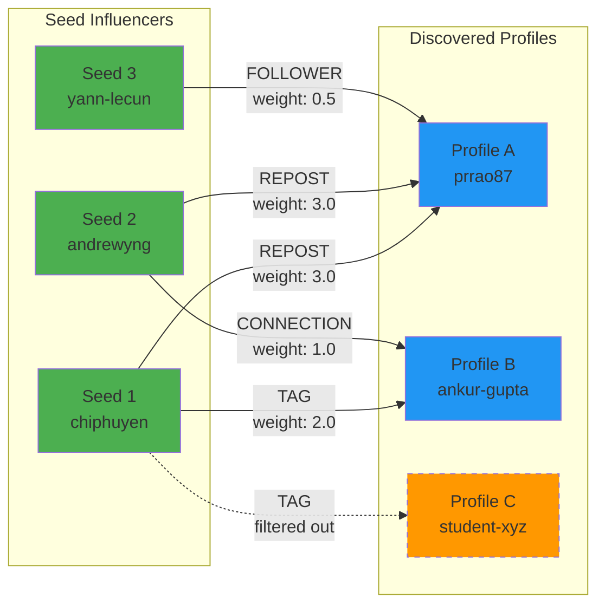
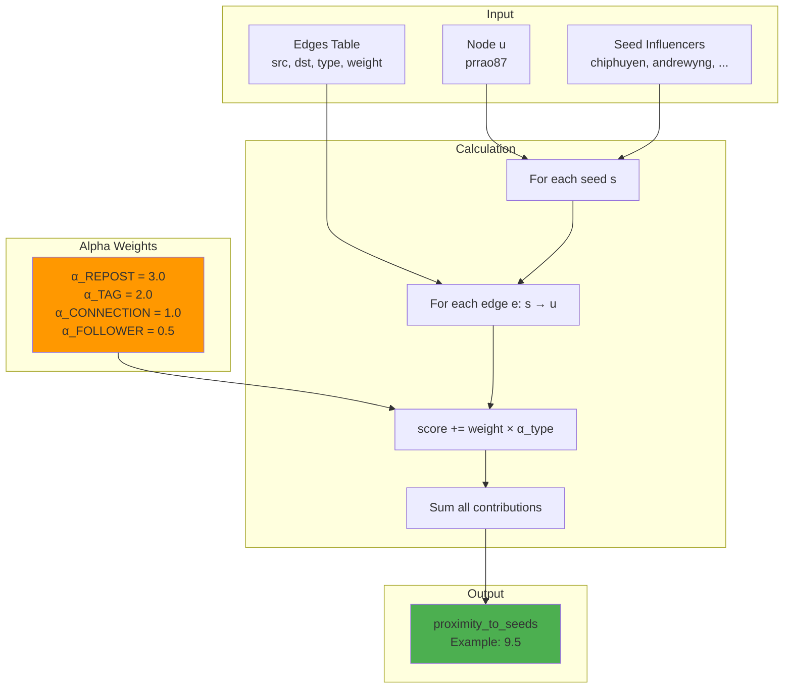
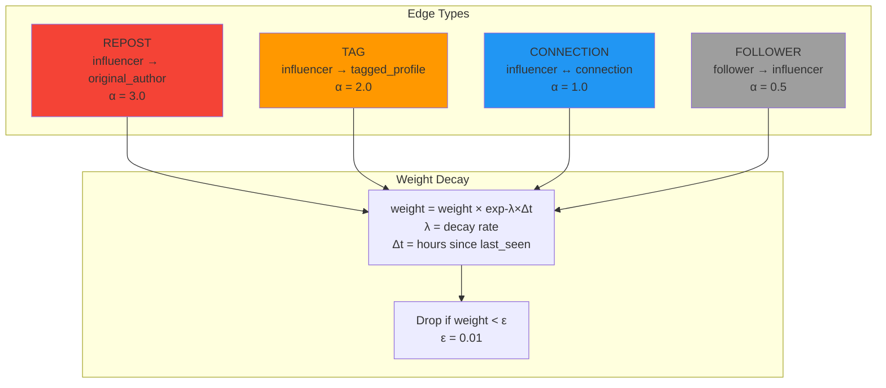
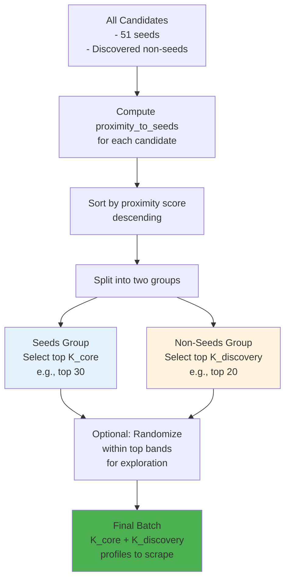
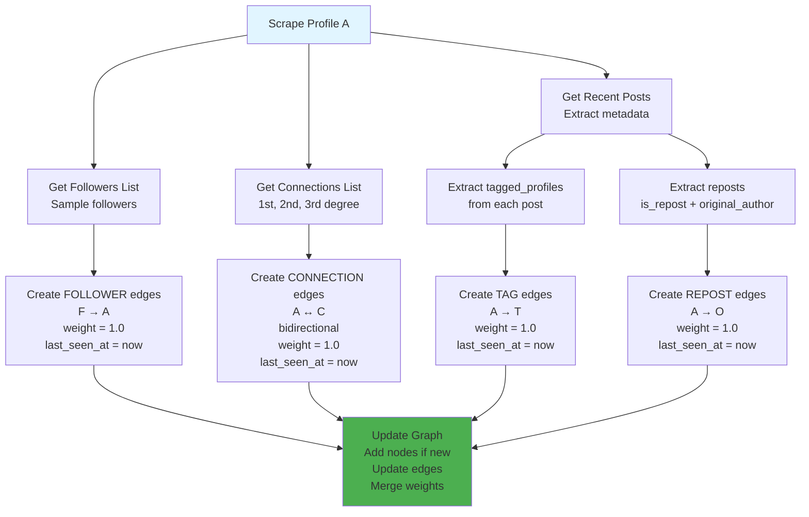
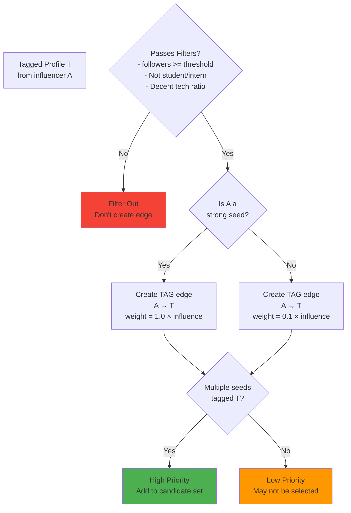
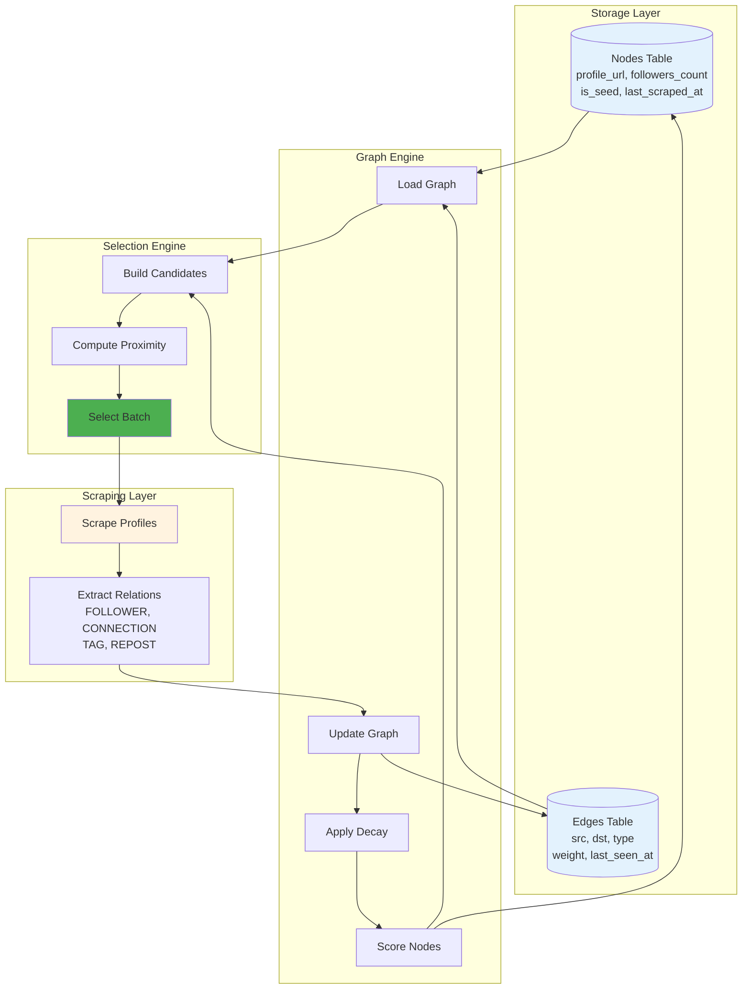

# Dynamic Graph Flow for LinkedIn Influencer Selection

## Complete Flow Diagram

```mermaid
graph TB
    Start([Start Scraping Run]) --> LoadState[Load Existing Graph<br/>- nodes table<br/>- edges table]
    
    LoadState --> BuildCandidates[Build Candidate Set<br/>- All 51 seeds<br/>- Non-seeds with edges from seeds]
    
    BuildCandidates --> ComputeProximity[Compute Proximity Scores<br/>For each candidate node u:<br/>proximity = Σ seeds Σ edges weight × α_type]
    
    ComputeProximity --> SelectBatch[Select Next Batch<br/>- Top K_core seeds<br/>- Top K_discovery non-seeds]
    
    SelectBatch --> ScrapeProfiles[Scrape Selected Profiles]
    
    ScrapeProfiles --> ExtractFollowers[Extract Followers<br/>Create FOLLOWER edges<br/>follower → influencer]
    
    ExtractFollowers --> ExtractConnections[Extract Connections<br/>Create CONNECTION edges<br/>A ↔ C bidirectional]
    
    ExtractConnections --> ExtractPosts[Extract Posts<br/>- Extract tagged_profiles → TAG edges<br/>- Extract reposts → REPOST edges]
    
    ExtractPosts --> UpdateGraph[Update Graph<br/>- Add new nodes<br/>- Add/update edges<br/>- Set last_seen_at]
    
    UpdateGraph --> ApplyDecay[Apply Time Decay<br/>weight = weight × exp-λ×Δt<br/>Drop edges with weight < ε]
    
    ApplyDecay --> RecomputeScores[Recompute Node Summaries<br/>incoming_tag_weight_from_seeds<br/>incoming_repost_weight_from_seeds]
    
    RecomputeScores --> SaveState[Save Updated Graph<br/>- nodes table<br/>- edges table]
    
    SaveState --> End([End - Next Run Starts])
    
    style Start fill:#e1f5ff
    style End fill:#e1f5ff
    style ScrapeProfiles fill:#fff4e1
    style ComputeProximity fill:#e8f5e9
    style ApplyDecay fill:#fce4ec
```

## Graph Structure Diagram

## Proximity Score Calculation

## Edge Types and Weights

## Selection Strategy

## Data Collection During Scraping

## Filtering Noisy Taggers

## Complete System Architecture

